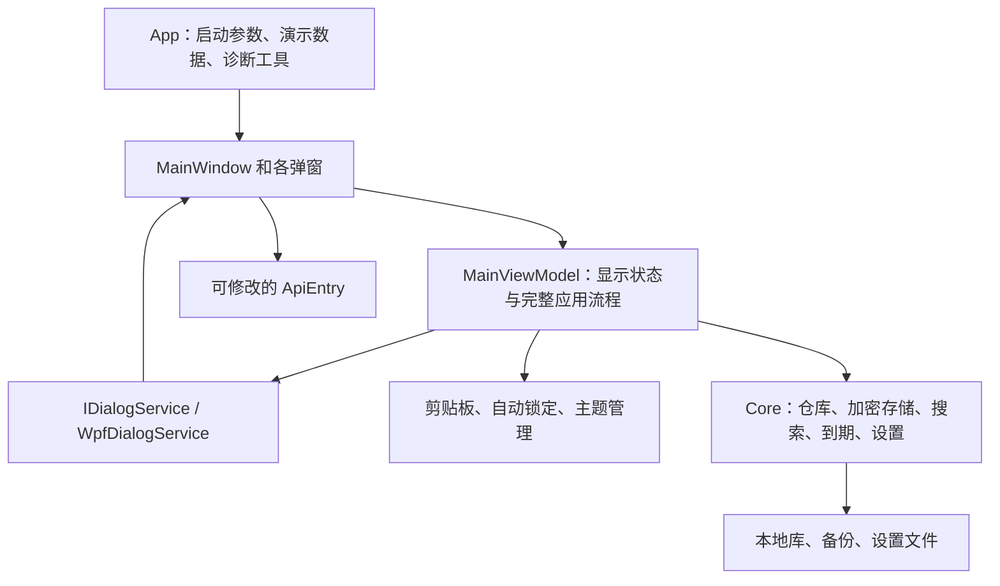
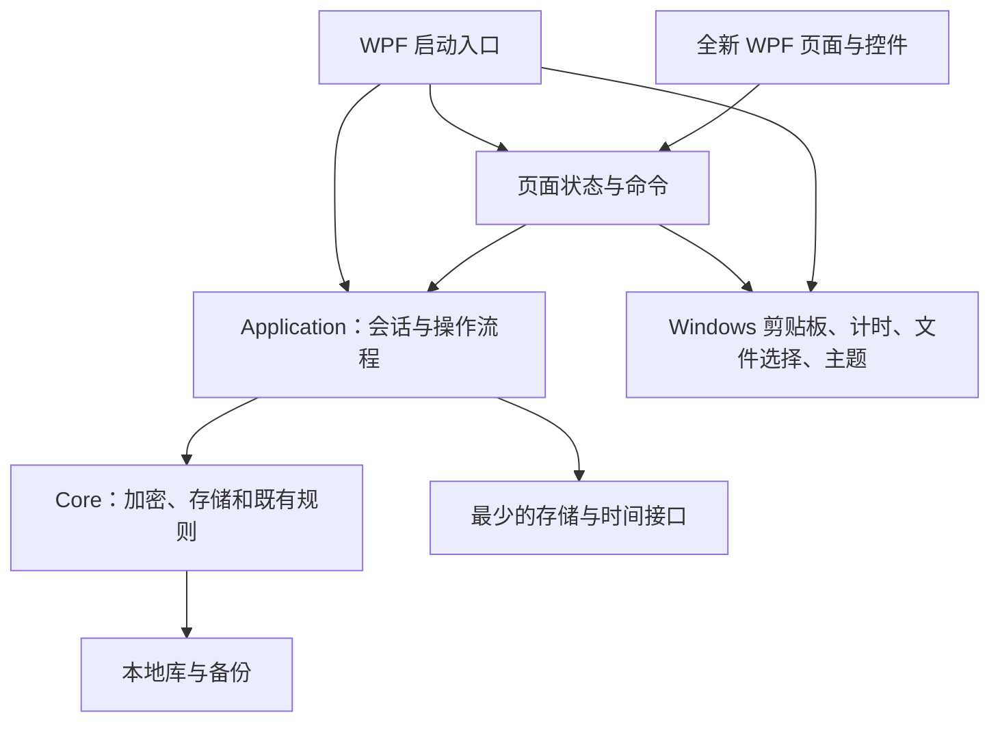

> 实施状态（2026-09-22）：B 方向已获用户确认；阶段 2–4 的工程实现及阶段 6 的切换准备已完成，阶段 5 自动化检查已落地，用户已确认核心五步及两项自动保护；缩放/多屏/辅助技术等实机项目仍有缺口。当前是核心功能获用户验收的本地替换候选，不标记为全量环境已验收。当前证据以 [实施记录](frontend-refactor-results.md) 与根目录 NEXT.md 为准；下方审查行号是改动前历史证据。

# API Key 管理器：前后端分离评估与前端深度重构计划

日期：2026-09-22。评估基线：`8c096ed`，审查开始时工作区干净。

状态：**用户已于 2026-09-22 确认按本方案开始实施。** 当前进度与证据只记录在根目录 `NEXT.md`；本文保留设计与实施合同。阶段 1 的具体视觉原型仍需展示后确认。

## 1. 结论与范围

**深度重构可行，推荐保留 WPF，重做全部界面，同时抽出一个独立的应用流程层。** 当前核心算法与 WPF 已分开，但完整业务流程仍依附旧界面。不能把现状理解成“后端已经完整，只需接一个新皮肤”。

本项目没有 HTTP 后端或远程服务。“后端”在本文指本地加密、文件存储、数据规则和应用流程；“前端”指窗口、页面、交互反馈和显示状态。“分离”主要是代码职责与依赖分离，不要求拆成两个进程。

主要目标：

- 日常操作围绕找到记录、复制密钥、核对与编辑信息展开。
- 界面可以完全重做，旧库、备份、记录字段和本地离线能力继续可用。
- 保存、密码修改、导入和锁定有明确的成功、失败、取消规则。
- 新界面不持有主密码，不直接读写库文件，不承担加密流程。
- 在真正的 Windows 窗口中验收，静态图片不作为最终完成证据。

推荐边界：保留 Windows 本地桌面工具定位；不加入账号系统、云同步、遥测、联网验证密钥、跨平台支持或新数据库。运行时升级另行评估，不与界面重构混在同一批改动中。

## 2. 当前分离程度

### 2.1 实际结构



| 边界 | 现状 | 分离判断 | 重构处理 |
| --- | --- | --- | --- |
| 加密及库文件格式 | `Core/Vault.cs` 实现，不引用 WPF | 较好 | 保留实现和格式，增加应用层调用边界 |
| 搜索、到期、CSV 规则 | 独立类，已有单元测试 | 较好 | 复用规则，重新连接真实流程 |
| 记录仓库 | 不依赖 WPF，但返回可变记录，修改和保存分两步 | 部分分离 | 用候选快照和统一提交保护实际状态 |
| 解锁、增删改、导入导出、改密码 | 集中在 `MainViewModel` | 较弱 | 移入应用流程层 |
| 系统能力 | 有包装类，但 ViewModel 直接创建剪贴板和计时器 | 较弱 | 由启动入口创建，再交给需要的对象 |
| 弹窗边界 | 抽象接口仍要求询问密码、就地编辑记录、调度 UI、退出应用 | 部分分离 | 普通输入由页面负责；用例返回结果，不指挥弹窗 |
| 设置 | 存储在 Core，包含主题和明文显示等界面偏好 | 部分分离 | 保留旧格式兼容，将显示偏好与会话状态分开 |
| 启动与生命周期 | `App`、主窗口、ViewModel 分别承担一部分 | 较弱 | 统一组装、计时、清理和退出路径 |
| 测试边界 | 测试只引用 Core；界面检查多为读取源码或 XAML | 底层较好、流程不足 | 新增直接执行应用层的测试与 WPF 实机检查 |

依据：

- [Core 工程](../src/ApiKeyManager.Core/ApiKeyManager.Core.csproj) 目标为 `net9.0`，没有 WPF 引用。
- [MainViewModel](../src/ApiKeyManager.Wpf/ViewModels/MainViewModel.cs) 构造函数直接创建 `ClipboardService`、`AutoLockWatcher`；直接调用 `ThemeManager`、`SettingsStore`、`VaultStore`。
- [IDialogService](../src/ApiKeyManager.Wpf/Services/IDialogService.cs) 的 `EditEntry(ApiEntry...)` 直接写回模型，`ChangePassword` 接收当前主密码，`Dispatch` 暴露 UI 调度。
- [EntryRepository](../src/ApiKeyManager.Core/EntryRepository.cs) 返回只读集合接口，但集合中的 `ApiEntry` 仍能被修改。只读集合不等于只读数据。
- [测试工程](../tests/ApiKeyManager.Tests/ApiKeyManager.Tests.csproj) 只引用 Core，未直接执行实际 MainViewModel。

因此：**算法独立程度高，流程独立程度低，系统能力可拆，整体属于部分分离。** 不使用未经测量的“已分离百分比”。Core 中也包含文件 I/O、设置和全局目录覆盖，不能将它称为完全无副作用的纯业务模型。

### 2.2 直接影响重构的已发现问题

P1 表示重构接入真实数据前应解决的重要流程问题；P2 表示本次应补齐的交互或工程边界。下列为源码证据，除特别标明外未做实机故障复现。

| 编号 | 级别 | 证据与触发条件 | 后果 | 本次处理及验证 |
| --- | --- | --- | --- | --- |
| F01 | P1 | `MainViewModel` 361–408、468–505 行：先增删改仓库，再保存；编辑器直接改原对象 | 保存失败后内存和磁盘不同步；之后别的保存可能夹带失败的修改 | 编辑草稿、候选快照、保存成功后再发布新状态；注入写入失败验证旧状态和文件不变 |
| F02 | P1 | `MainViewModel` 579–590 行：改密码先 `_password = newPwd`，然后保存 | 写入失败时会话已使用新密码，磁盘仍使用旧密码；后续保存可能悄悄改用新密码 | 重加密完成后才切换会话凭据；验证失败后仍可用旧密码读取 |
| F03 | P1 | `TickClipboard()` 只有定义；全仓搜索未找到定时调用 | 源码中的正常使用路径未接通“30 秒自动清理”，即使底层清理规则测试通过 | 独立清理服务拥有计时器；真实复制后持续保持解锁验证到期清理 |
| F04 | P1 | `AutoLockWatcher.Pause()` 无调用；模态编辑等待期间计时仍可运行，锁定将 `_repo` 置空 | 长时间停留编辑窗口后可能出现重叠解锁窗；旧编辑返回后访问失效仓库或跨会话提交 | 会话版本校验；锁定关闭敏感编辑并使旧提交失效；实测编辑中自动锁定 |
| F05 | P1 | `BackupBeforeOverwrite()` 捕获异常返回 null；替换导入和迭代升级未要求备份成功 | 无恢复副本仍可能执行覆盖，弱于界面与文档承诺 | 替换导入要求备份成功；升级备份失败则跳过升级并提示，保留本次解锁 |
| F06 | P2 | 启动读取设置后未应用保存的主题；导入读取了 `VaultData.Settings` 但未恢复 | “主题保存”和“备份带偏好”的文件能力没有闭合到使用流程 | 明确启动优先级；导入可选择恢复安全范围内的偏好，永不恢复明文显示 |
| F07 | P2 | 加密和文件读写由同步命令直接调用 | 解锁、保存、导入可能占住 UI 线程，缺少忙碌状态和重复提交保护；时长未测 | 后台执行纯计算/I/O，单写入队列；UI 显示处理中，不编造进度百分比 |
| F08 | P2 | `--demo` 生成演示库，但主窗口始终调用无参数 `Start()` | 演示自动解锁与 README 描述不一致，不能直接相信旧验收脚本假设 | 将启动选项显式传给应用；演示自动解锁只用于隔离演示目录 |
| F09 | P2 | `ClipboardGuard.Tick(force)` 在 force 下不比较当前剪贴板；调用失败后仍清掉追踪状态 | 锁定/退出可能清掉用户后来复制的其他内容；失败后可能不再重试 | 任何清理都校验仍为本应用内容；对失败做有限重试并返回可观测结果 |
| F10 | P2 | `IterationUpgradeFlowTests` 重新拼装流程；无障碍测试主要读 XAML 文本 | 测试全部通过不能证明真实启动、计时和操作流程正确 | 测实际应用服务，不在测试中复制流程；补真实键盘和计时验证 |

此前视觉审查中的搜索框过窄、固定八列、标签溢出、全局明文显示持久化、“不提醒”清空日期等问题一并纳入新界面合同。它们无需保留旧实现。

## 3. 技术路线可行性

| 路线 | 可复用部分 | 新增工作和代价 | 评估 |
| --- | --- | --- | --- |
| **WPF 全新界面 + 独立应用层** | Core、Windows 能力包装、构建链 | 重做视图和交互，抽出流程，补测试 | **推荐；可行性高，工程风险中等** |
| Avalonia + 原 Core | 大部分 Core 和未来应用层 | 新窗口/控件体系、平台适配、打包和自动化验收 | 有跨平台需求时重新评估；本轮收益不足 |
| WebView2 + Web 界面 + .NET 宿主 | Core 和应用层 | 增加消息桥、浏览器状态生命周期、运行时分发、安全边界和双套构建 | 可行但复杂；有明确 Web 组件需求时再评估 |
| 独立 Web 前端 + 本地/远程服务 | 部分核心逻辑 | 端口、认证、服务生命周期、部署和数据边界改变 | 不适合当前便携离线定位 |

WPF 足以实现新的排版、现代控件状态、详情面板与轻量过渡。视觉质量不要求换框架。若后续明确需要跨平台或网页形态，先抽出的应用层仍能复用。

承载面：独立桌面界面，适配等级 suitable；降级方案是在新 WPF 中使用更简洁的原生控件，仍完成同一功能合同。当前不需要用户承担高风险框架迁移。

## 4. 目标架构与状态归属

只增加一个 `ApiKeyManager.Application` 项目，不拆出网络服务、通用插件框架或多套数据访问层。



图中宿主负责把实现交给调用者；Application 不引用 WPF。系统文件选择返回路径，具体导入导出由 Application 执行。接口只在需要替换实现、注入失败或控制时间的边界使用。

| 状态 | 唯一负责者 | 限制 |
| --- | --- | --- |
| 主密码、已解锁仓库、会话版本 | 应用层会话对象 | 主密码不进入普通页面状态、不传给改密码弹窗作比较 |
| 已保存记录 | 应用层发布的快照 | 页面拿摘要或草稿，不拿仓库可变对象 |
| 搜索、筛选、排序、当前选中项 | 工作区 ViewModel | 搜索不匹配密钥；刷新按 Id 恢复选择 |
| 编辑字段和校验错误 | 编辑草稿 | 取消编辑不改变仓库；失败保留草稿供重试 |
| 单条明文显示 | 短时查看状态 | 锁定、切换记录、超时后隐藏；不持久化 |
| 剪贴板追踪和清理时间 | 剪贴板服务 | 定时器归服务所有，不依赖某个页面是否存在 |
| 自动锁定 | 会话策略 + Windows 活动适配器 | 所有页面统一；不能因弹窗或详情页绕过 |
| 主题、窗口大小等非敏感偏好 | 偏好服务 | 可保存；异常范围归一化；保存失败明确可观测 |

建议的应用入口按功能组织：解锁/建库、读取记录摘要、保存草稿、删除、准备/提交导入、导出、改密码和锁定。普通结果使用结构化错误类型，页面负责转换为中文提示。后台错误不得附带密码或密钥原文。

### 4.1 保存和并发合同

1. 使用当前快照建立候选数据，在候选上执行修改。
2. 校验记录和会话版本，进入唯一写入通道。
3. 调用现有加密存储完成写入；成功后更新应用状态，再通知界面。
4. 写入失败：保留原会话、原已保存状态和可重试草稿，不显示成功。
5. 保存开始后禁止重复提交；取消仅在尚未提交时有效。已进入原子替换阶段不假装可以撤回。
6. 锁定立即遮蔽敏感信息，使旧页面和旧操作结果失效。已开始的写入按确定规则收尾，不得自动重新解锁或把明文回填进新会话。
7. 单个应用实例内串行写入；多实例同时打开同一库的排他策略在阶段 0 核实并冻结，不宣称现状已支持多实例安全写入。

### 4.2 密码、锁定和草稿

- 改密码：由应用层验证旧密码；新密码成功写入并验证后才更新会话凭据。
- 自动锁定与手动锁定都进入同一锁定页面，停止旧页面操作并清除敏感绑定。
- 编辑时到达锁定期限，应终止当前编辑会话并清除敏感草稿；提前给出锁定提示。不得把未保存明文草稿写入磁盘以图方便。
- 页面销毁时解除事件订阅、停止页面计时器；服务计时器由宿主统一释放。
- 清除引用不等于证明托管内存中的所有秘密字节已被抹除，不作这种保证。

## 5. 全新界面的产品设计

### 5.1 定位和视觉

已确认方向：**B「温润档案风」**。用户在阶段 1 明确选择该方向并要求继续重构。生产界面采用暖灰纸白与低饱和绿色，配套深色主题；精密工具风仅留在历史对照原型。

设计起点（需原型验证，不视为已验收规格）：

- 默认窗口约 1180 × 760 个逻辑像素，按当前屏幕工作区限幅；最小目标约 900 × 600。
- 正文约 14，辅助文字 12–13，页面标题 20–24；密钥和 URL 使用等宽字体。
- 常规控件高 36–40；列表行高约 48，必要的双行条目约 56。
- 以 4/8/12/16/24 为主要间距；减少外围卡片嵌套，控件圆角约 6–8。
- 过渡约 120–180 ms，仅用于状态反馈和面板展开，遵循系统减少动画偏好。
- 深浅主题均覆盖输入框、日期控件、滚动条、菜单、提示、选择态和标题栏；普通文字对比度目标至少 4.5:1，焦点等非文字关键信息目标至少 3:1。

### 5.2 页面与主路径

| 页面/区域 | 内容与操作 | 必须覆盖的状态 |
| --- | --- | --- |
| 首次建库/解锁页 | 主密码、确认密码、库位置辅助信息、解锁/创建 | 首次使用、锁定、密码错误、文件不可读、处理中 |
| 密钥工作区 | 搜索、平台/标签筛选、到期筛选、列表、行内复制、新增 | 有记录、空库、无结果、忙碌、错误、已选中 |
| 详情面板 | 完整 URL、模型、标签、备注、到期、更新时间、编辑/删除 | 无选择、正常、临时显示、复制成功/失败 |
| 编辑面板 | 基本信息、连接信息、管理信息；固定保存/取消区 | 新建、编辑、校验失败、未保存、保存中、失败重试 |
| 数据管理 | 加密备份、合并/替换导入、明文 CSV | 文件选择、密码错误、预览、确认、处理中、结果 |
| 设置 | 主题、自动锁定、剪贴板清理、主密码修改、数据位置 | 有效值、非法值、保存失败、重加密中 |

常用流程：解锁 → 搜索/筛选 → 识别记录 → 原位复制 → 可见反馈。新建和编辑保存后保持相关记录可见或明确说明被当前筛选隐藏。

主界面不再展示八个等权列。建议保留名称/平台、密钥摘要、到期状态、复制入口；完整连接信息移到详情。宽窗口显示列表与详情分栏，窄窗口使用可关闭的详情面板，不强塞第三列。主操作始终可达，不靠把窗口拉到 1600 才能使用。

列表优先采用虚拟化 ListBox 和新的行模板，适合精简记录视图。若原型验证表明用户需要重度列比较，再选择 DataGrid；该选择必须在阶段 1 冻结，避免同时维护两套列表。

### 5.3 关键交互

- 保留 Ctrl+F、Ctrl+N、Ctrl+L、Ctrl+T；增加列表聚焦时的复制快捷操作和 Enter 查看详情。不要拦截文本框正常复制。所有快捷键可发现。
- 复制结果在按钮附近显示，并通过辅助技术可读取的状态提示报告；不要只更新遥远的底部状态栏。
- 每条记录短时显示密钥；重新解锁一律隐藏。不提供默认恢复的“全局明文”状态。
- 到期提醒使用工作区内可点击提示，点击筛选相关记录；不在每次解锁后强制弹一个只能关闭的窗口。
- 保留空密钥、本地 URL、自建平台；只对确实不合理的格式提示，不强制联网校验。
- “不提醒”改为与当前数据语义一致的“未设置到期日”。独立的“保留日期但关闭提醒”暂不增加，避免本轮扩展数据格式。
- 删除明确记录名称并二次确认；CSV 明确是明文，在执行前确认。
- 导入先给出新增、重复和替换数量；保留按 Id 合并规则，名称相同不擅自合并。主按钮写出实际动作。
- 自动锁定值和剪贴板清理值使用有界输入，关闭状态明确可见；不使用“0=关”作为主要说明。

## 6. 兼容与复用账本

| 资产 | 决定 | 保留/改变的范围 |
| --- | --- | --- |
| VaultStore、文件头和加密格式 | 复用 | 不改变算法、格式版本、默认参数；旧库可直接读取 |
| ApiEntry 的存储字段 | 复用 | 保留 Id、创建/更新时间、字符串标签及 `ExpiresUtc` 的既有本地日期语义；不能因名字像 UTC 就转换旧日期 |
| EntrySearch、ExpiryPolicy、CsvExporter | 复用 | 保留搜索范围、日期判定、CSV 转义；CSV 列格式本轮不扩展 |
| EntryRepository | 改造使用方式 | 不让视图直接修改原对象；快照提交责任归应用层，必要的最小接口调整单列审查 |
| ClipboardGuard / Windows 包装 | 改造 | 纠正强制清理行为、明确结果和重试、接通计时 |
| AutoLockWatcher | 改造 | 保留 Windows 活动检测能力，改变对窗口流程的控制方式 |
| 旧 View、ViewModel、控件模板 | 替换 | 不保留旧视觉和弹窗交互约束；迁移期间仅作对照 |
| 主题资源 | 仅参考 | 复用语义化配色方法，不保证旧 token 名永久兼容 |
| 旧测试 | 分类保留 | 保留底层行为测试；旧控件名、旧文件名等结构断言随替换更新，不能只为变绿删除保护 |
| 演示、布局及发布脚本 | 改造 | 对新页面和启动流程更新；必须限定测试进程和测试目录 |

旧 `settings.json` 和带偏好的备份继续可读。保留 Theme、自动锁定和剪贴板清理的有效设置；旧 `ShowKeys=true` 接受读取但不恢复明文显示。可新增有默认值的非敏感偏好，但不让缺字段的旧文件失效。

注意现有 `verify-publish.ps1` 会按进程名终止程序并删除输出目录。未来验收需改成只管理本次启动的测试进程和已经核实的专用目录，不能直接对用户正在使用的实例运行。

## 7. 分阶段实施蓝图

采用 **single-blueprint：一份总设计、一份实施顺序、一份续接记录** 的轻量规模，不拆子项目群。当前本文是供审阅的合并方案；确认后再按需要整理为设计/实施文档，并建立唯一的 `NEXT.md` 记录进度，避免重复维护多份当前状态。

阶段顺序：0 → 1 → 2 → 3 → 4 → 5 → 6。阶段结束必须有退出证据；不把“完成 XAML”当作功能完成。

| 阶段 | 工作和输出 | 修改边界 | 退出条件 |
| --- | --- | --- | --- |
| **0：冻结基线与兼容合同** | 功能清单、旧格式样本、故障清单、旧界面行为对照、写入与锁定策略；核实多实例行为 | 文档和必要的测试夹具，全部使用合成数据 | 旧库/备份/设置可读的基线通过；每项旧功能有新入口；高风险行为有明确结果 |
| **1：设计与真实尺寸原型** | 推荐风格与一个对照风格；主界面、编辑、锁定的静态稿；选定后制作 WPF 交互原型 | 新视图与资源，使用假数据，不连接用户库 | 宽窄窗口和深浅主题成立，搜索/详情/编辑能操作；用户确认视觉和主要交互 |
| **2：抽出应用层与可靠提交** | 会话、草稿、快照提交、存储边界、改密码、导入、剪贴板/锁定服务合同 | 新 Application 项目、必要 Core/宿主接口、应用层测试 | 直接测试真实用例，失败注入通过；无 WPF 引用；旧数据格式往返一致 |
| **3：交付第一个可用新版** | 新锁定页、工作区、详情、搜索、复制、单条显示、新增/编辑、主题、自动锁定 | 新页面、ViewModel、宿主连接 | 在隔离测试库完成解锁→新增→保存→复制→锁定→重启读取，并演示一次保存失败可重试 |
| **4：补齐全部原有能力** | 删除、备份、合并/替换导入、CSV、改密码、设置恢复、强度升级、演示和诊断入口 | 数据管理/设置页、剩余应用用例、相关脚本 | 功能对照清单全部有证据；完整替换版不缺旧功能；备份失败不继续覆盖 |
| **5：视觉、无障碍和性能验收** | 所有状态、DPI/窗口矩阵、键盘/读屏、长文本/大量记录、异步操作、故障回归 | 只修已发现的验收问题，不增加新功能 | 自动化和 Windows 实机均通过；性能实测达标；用户完成核心路径试用 |
| **6：切换入口与清理旧前端** | 新 UI 成为唯一默认入口；清理无引用旧页面/资源；更新 README、工具和本地打包检查 | 被替代的旧前端、明确受影响的测试/文档/脚本 | 新版完整通过后才移除旧实现；历史可恢复，旧库兼容；交付本地候选版本和证据 |

阶段 3 是内部试用里程碑，**不是完整重构交付**。阶段 4–6 仍在本次计划内，不以“首版做完”省略已有功能。

### 7.1 第一份可试用成果的合同

- 目标用户：本地管理多平台密钥的 Windows 用户。
- 入口：隔离目录启动的新 WPF 应用，首次建库或已有库解锁。
- 核心循环：解锁 → 搜索或新增 → 保存成功 → 找到同一记录 → 复制 → 锁定 → 重新解锁确认。
- 状态源：Application 的已保存快照；页面草稿不是已保存事实。
- 失败路径：错误密码、写入失败、剪贴板占用、编辑期间自动锁定。
- 交付物：可运行的调试版本、新页面和资源、应用层及其测试、合成夹具、操作证据。
- 此里程碑暂不接入真实用户库；备份/导入等在阶段 4 补齐后才成为完整替换候选。
- 自动化负责数据与状态规则，实机负责窗口/焦点/计时/交互，用户负责视觉和工作方式是否满意。

### 7.2 预期代码组织

```text
src/ApiKeyManager.Core/             既有加密、格式、搜索与到期规则
src/ApiKeyManager.Application/      新增：会话、用例、结果类型、必要接口
src/ApiKeyManager.Wpf/
  Views/                           新锁定页、工作区、编辑、数据管理、设置
  ViewModels/                      页面状态与命令
  Themes/                          新配色、排版、控件状态与资源
  Services/                        Windows 适配与启动组装
tests/                             保留 Core 测试，增加应用流程和 WPF 验收
tools/                             隔离演示、截图、布局及本地构建验证
```

只建立实际需要的类型；不预建大量空服务。是否独立出 Windows 平台项目留待确有第二个消费者时再判断。

### 7.3 改动预算与回退

- 这是整体界面替换，不伪装成小于 200 行的局部补丁。预算按模块和功能合同控制：只新增一个生产项目、默认不增加第三方 UI 框架依赖、不改变加密文件格式。
- 每个实施批次只处理一个页面或一条应用流程，记录实际文件和行数；实际规模超出当前批次时拆批，不顺手扩展功能。
- 旧 UI 在新核心路径成立前作为内部对照保留；迁移期间同一库不得同时由两套会话写入。完整验收后删除旧实现，不长期保留双前端维护负担。
- 回退使用基线代码与隔离测试数据；未来涉及真实库时先验证备份可恢复。代码回退不能恢复用户之后新增的数据，数据恢复必须单独处理。
- 密码改动成功后，回退旧程序仍需使用新密码；不能承诺程序回退等于密码回退。
- 若发现必须改变库格式、核心产品定位或引入新运行时，停在该边界重新评估，不静默扩大计划。

## 8. 验证矩阵与验收标准

| 层级 | 检查内容 | 通过标准 |
| --- | --- | --- |
| Core 回归 | 加密往返、错误密码、损坏文件、CSV、到期、搜索 | 原有规则测试保持有效；旧样本可读，重存后数据字段一致 |
| 应用流程 | 新建、修改、删除、导入、改密码、强度升级 | 直接调用真实用例；成功才更新状态；失败无隐式提交 |
| 故障注入 | 文件权限/占用、备份失败、设置保存失败、重复操作 | 有明确错误和重试入口；不写坏旧库；不显示假成功 |
| 会话生命周期 | 编辑中锁定、保存中锁定、重复解锁、关闭 | 不重叠解锁、不跨会话回填；旧任务不能使锁定页泄露数据 |
| 剪贴板 | 正常复制、占用、到期、用户另复制、锁定退出 | 清理自己的内容，不清理后来的外部内容；失败可观测 |
| 布局 | 900/1180/1600 逻辑宽度；600/760 逻辑高度；100/125/150/200% 缩放 | 主操作始终可达，无标签重叠和不可达字段；按实际屏幕工作区限幅 |
| 视觉与辅助技术 | 深浅主题、焦点、悬停、禁用、错误、读屏、Tab/Escape | 状态可辨认，不仅靠颜色；键盘完成核心路径，焦点去向可预测 |
| 数据规模 | 0/1/100/1000 条；超长名称/URL/标签/备注 | 列表虚拟化有效，完整信息可访问，不因数据长而撑破窗口 |
| 发布候选 | 框架依赖和自包含本地构建、启动、自检 | 实测产物可启动；报告实际体积，不沿用旧体积宣称 |

建议性能目标（尚未实测）：在记录了硬件、构建模式和数据规模的目标机器上，1000 条记录的搜索从最后输入到结果稳定 P95 不超过 200 ms（包含输入防抖）；复制反馈通常在 100 ms 内出现；解锁/保存期间 UI 能持续响应，不把加密时间算作界面无响应。阶段 0 记录旧基线，阶段 5 按同条件比较；不承诺所有机器同一耗时。

所有测试使用合成密钥和专用目录。截图不包含真实密钥或真实用户数据。真实用户库迁移、Git 提交/推送、安装和外部发布不随本计划自动发生。

## 9. 本轮证据与覆盖缺口

已执行：

- `dotnet test ApiKeyManager.sln --no-restore --verbosity minimal`：**135 通过，0 失败，0 跳过**。
- `dotnet build src/ApiKeyManager.Wpf/ApiKeyManager.Wpf.csproj --no-restore --verbosity minimal`：**成功，0 警告，0 错误**。
- 本机 SDK：`9.0.101`。

已审阅：Core 的全部 7 个实现文件及工程依赖；主 ViewModel、记录 ViewModel、命令、主窗口、编辑/密码窗口、对话框和 Windows 服务；启动流程；主题与主界面结构；测试项目及代表性流程/无障碍/设置测试；演示、发布脚本的关键入口；上一轮查看的主界面与弹窗历史截图。

部分覆盖：测试套件已全部运行，但未逐条审查所有测试源码；其余 UI 自动化脚本仅作为后续迁移清单，未完整验证；图标生成与发行打包实现没有做全量审计。

未执行：真实 Windows GUI 交互、剪贴板计时实测、磁盘故障注入、真实库迁移、多显示器缩放、发布产物启动、用户验收。因此本报告是**架构重点审查和重构计划**，不是全仓安全审计或新版已完成证明。

## 10. 决策账本、工程门与续接

| 状态 | 决策 |
| --- | --- |
| 已确认 | 用户允许完全替换旧界面，并已要求按本方案实施；保留 WPF、增加 Application、列表加详情、执行阶段 0–6 |
| 已确认 | 阶段 1 用户选择 B「温润档案风」，继续阶段 2–6 |
| 待验收 | 正式新版的用户核心路径试用、真实系统输入/剪贴板/DPI/读屏；多实例策略已按基线实现 |
| 暂存 | Avalonia/WebView2、云同步、批量操作、独立提醒开关、平台专属模板、联网密钥验证 |
| 已否决 | 本轮没有用户明确否决项；“暂存/不推荐”不冒充用户已否决 |

本轮路线与迁移策略作为一个基础决策方向，默认最多 4 轮，当前已进行 1 轮、剩余 3 轮；这是防止反复发散的讨论约束，不是工期或实施次数。其他方向尚未开启独立讨论。

后续更新只在触发条件成立时讨论：明确跨平台需求再评估 Avalonia；大量重复录入证据出现再评估模板/批量功能；用户确实需要保留日期且静音提醒时，再设计兼容字段。它们不占用本次完成标准。

工程决策：

- Core 的算法与格式：`No Refactor`，保留；服务失败结果及仓库调用边界允许有证据的局部调整。
- 应用流程和 Windows 适配：`Refactor Backlog / Staged Refactor`，按阶段 2 分批拆分。
- WPF 视图和页面状态：整体替换方案已获得用户实施授权，不重复索取“可否重构”的授权；具体原型在阶段 1 展示并验收。
- 执行进度见根目录 `NEXT.md`。`runtimePersistentBlueprintBudget = 0`：不自行增加持久子蓝图；出现具体失败时允许一层临时排查，关闭后返回原阶段。
- A0：已读取 ST-A0；Library 路由 `code-quality-workflow`，快照 `2026-08-18`；未选用设计目录候选。目标是评估并交付计划；本轮红线是源码及用户数据不变；验收是源码证据、构建/测试基线、完整阶段/风险/兼容合同齐备。
- 实施从阶段 0 开始；视觉原型确认安排在阶段 1 成果可查看时，不先要求用户批准空泛风格。

可执行续接语句：**“按这份方案执行，保留 WPF，从基线和设计原型开始。”**
